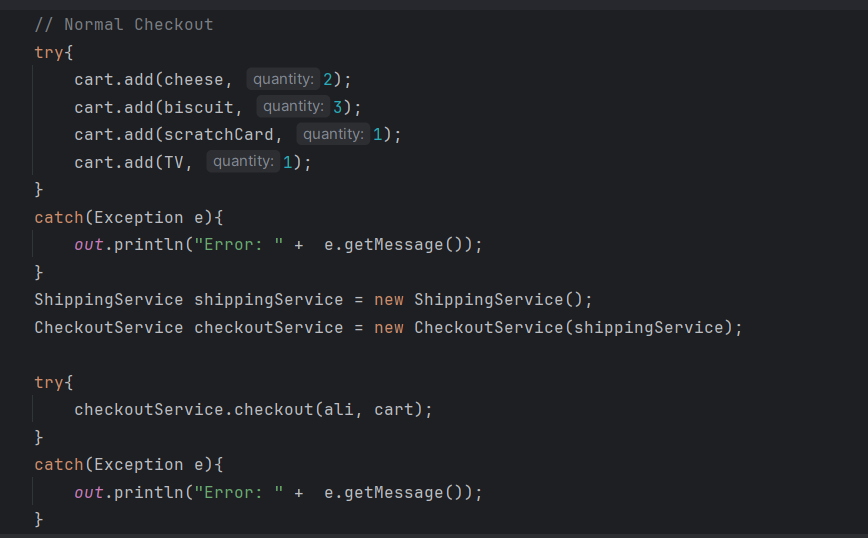
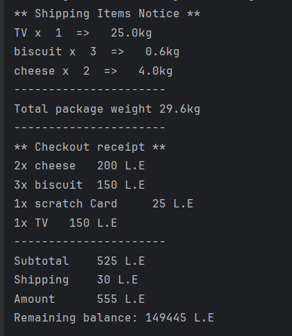
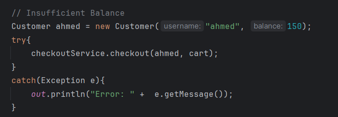
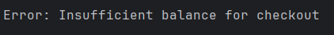
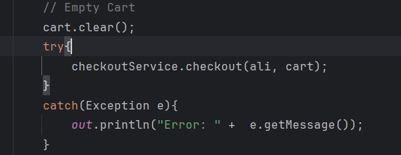
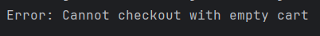
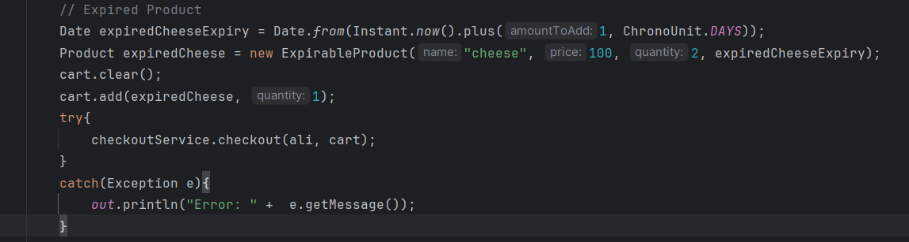
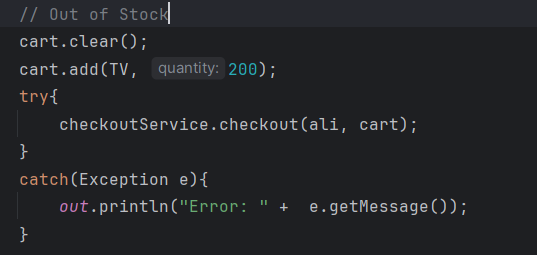

# Shopping Cart System
A Java-based e-commerce cart implementation with product management and checkout functionality.

## Abstract
This system handles product catalogs, shopping carts, and checkout processes. Built to manage perishable goods with expiration dates, shippable items with weight calculations, and customer transactions.

## Features:
- Product Types: Perishable and non-perishable products with expiration tracking

- Inventory Management: Real-time stock validation and quantity control

- Smart Cart: Automatic duplicate consolidation and balance verification

- Shipping Integration: Weight-based calculations and automated notifications

- Checkout Process: Receipt generation and inventory updates.

## Architecture
Built around Product hierarchy, Cart management, and separate services for checkout and shipping operations.

### Normal Checkout && its output

  
  

### Insufficient balance && its output

  
  

### Empty Cart && its output

  
  

### Expired Product

  

### Out of Stock

  

